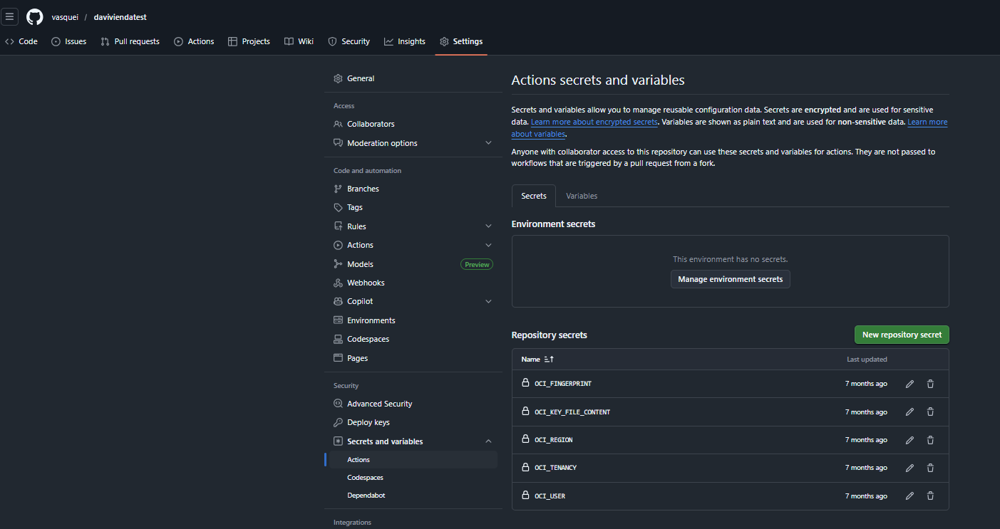
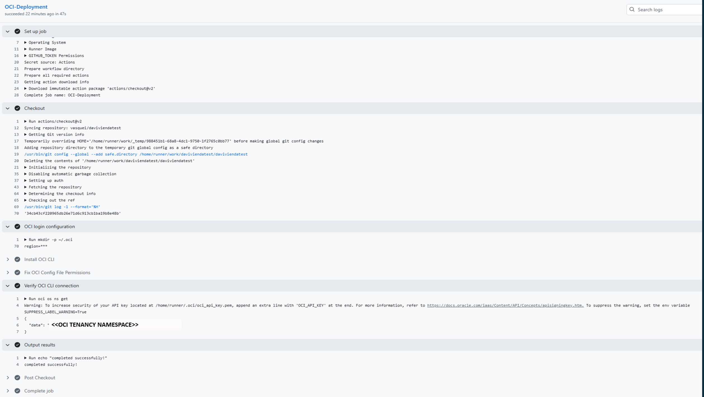

# Authenticating to Oracle Cloud Infrastructure (OCI) from GitHub Actions 

## Introduction

This tutorial explains how to authenticate to **Oracle Cloud Infrastructure (OCI)** from **GitHub Actions** in order to run a OCI command.

The solution enables secure, automated authentication from GitHub Actions to OCI using OCI API credentials.

At the end of this tutorial, you will be able to:

- Authenticate from GitHub Actions to Oracle Cloud Infrastructure (OCI)
- Execute any application or program from GitHub pipeline (for example: Terraform, OCI SDKs, CLI Tools, custom scripts, etc)
- Validate successful connectivity between GitHub Actions and OCI

---

## Architecture Overview


---

## Prerequisites

- OCI Tenancy
- OCI User with API Key
- OCI Compartment
- GitHub Repository

---

## High-Level Flow

1. Store OCI credentials as GitHub Secrets  
2. Configure GitHub Actions workflow  
3. OCI CLI uses those secrets to authenticate to OCI  
4. GitHub Actions executes OCI CLI commands or any custom automation  

---

## Required GitHub Secrets

In your GitHub repository:

**Settings → Secrets and variables → Actions → New repository secret**

Create the following secrets:

| Secret Name | Description |
|------------|-------------|
| OCI_TENANCY | OCI Tenancy OCID |
| OCI_USER | OCI User OCID |
| OCI_FINGERPRINT | API Key fingerprint |
| OCI_KEY_FILE_CONTENT | Private API Key (PEM content) |
| OCI_REGION | OCI region (e.g. us-ashburn-1) |




---

##  `main.yaml` file

The main.yml GitHub Actions workflow establishes a secure connection between GitHub Actions and Oracle Cloud Infrastructure (OCI) using the OCI CLI.

During execution, the workflow dynamically creates the OCI CLI configuration file using credentials stored as GitHub Secrets, installs the OCI CLI on the runner, repairs file permissions, and validates connectivity by executing a test OCI command.

Once completed, the pipeline is authenticated and can execute any OCI-related operations, including running OCI CLI commands, SDK-based applications, Terraform, or custom automation scripts.


`main.yaml`

```
name: Create OCI platform with Terraform

on:
  workflow_dispatch:

jobs:
  OCI-Deployment:
    runs-on: ubuntu-latest

    steps:
      - name: 'Checkout'
        uses: actions/checkout@v2

      - name: 'OCI login configuration'
        run: |
          mkdir -p ~/.oci
          echo "[DEFAULT]" > ~/.oci/config
          echo "user=${{secrets.OCI_USER}}" >> ~/.oci/config
          echo "fingerprint=${{secrets.OCI_FINGERPRINT}}" >> ~/.oci/config
          echo "tenancy=${{secrets.OCI_TENANCY}}" >> ~/.oci/config
          echo "region=${{secrets.OCI_REGION}}" >> ~/.oci/config
          echo "${{ secrets.OCI_KEY_FILE_CONTENT }}" > ~/.oci/oci_api_key.pem
          chmod 600 ~/.oci/oci_api_key.pem
          echo "region=${{secrets.OCI_REGION}}"
          echo "key_file=~/.oci/oci_api_key.pem" >> ~/.oci/config

          echo "${{secrets.OCI_KEY_FILE_CONTENT}}" > ~/.oci/oci_api_key.pem
          chmod 600 ~/.oci/oci_api_key.pem

      - name: 'Install OCI CLI'
        run: |
          curl -L -O https://raw.githubusercontent.com/oracle/oci-cli/master/scripts/install/install.sh
          chmod +x install.sh
          ./install.sh --accept-all-defaults
          echo "/home/runner/bin" >> $GITHUB_PATH

      - name: 'Fix OCI Config File Permissions'
        run: |
          oci setup repair-file-permissions --file /home/runner/.oci/config
          oci setup repair-file-permissions --file /home/runner/.oci/oci_api_key.pem

      - name: 'Verify OCI CLI connection'
        run: |
          oci os ns get

      - name: Output results
        run: echo "completed successfully!"

```

## Successful GitHub Actions → OCI Authentication Execution

The following image shows a successful execution of the GitHub Actions workflow that configures OCI authentication and validates connectivity using OCI CLI.



### What This Execution Demonstrates

- The GitHub Actions runner was successfully created (`Set up job`)
- The repository code was checked out (`Checkout`)
- The OCI configuration and private key were generated dynamically from GitHub Secrets (`OCI login configuration`)
- OCI CLI was installed on the runner (`Install OCI CLI`)
- File permissions were repaired to meet OCI security requirements (`Fix OCI Config File Permissions`)
- A test OCI CLI command was executed successfully (`Verify OCI CLI connection`)
- The workflow completed without errors (`completed successfully!`)

### Key Validation Step

During the step **Verify OCI CLI connection**, the workflow executes:

```
oci os ns get
```

The command returns the Object Storage namespace of the tenancy:

```
{
  "data": "<<OCI tenancy namespace>>"
}
```

### This output confirms that:

- Authentication to OCI is working

- GitHub Actions can reach OCI APIs

- The OCI CLI configuration is valid

### Result

With this successful execution, the GitHub Actions pipeline is now authenticated to OCI and can run any OCI-related operation such as:

- OCI CLI commands

- SDK-based applications

- Terraform workflows

- Custom automation scripts


---

## Author

**Ivan Vasquez**  
LAD A-Team Cloud Solution Specialist  
Oracle Cloud Infrastructure (OCI)

